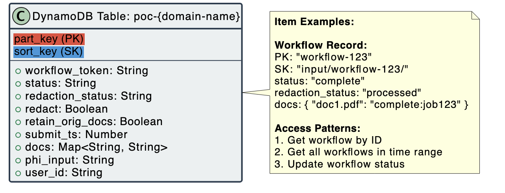
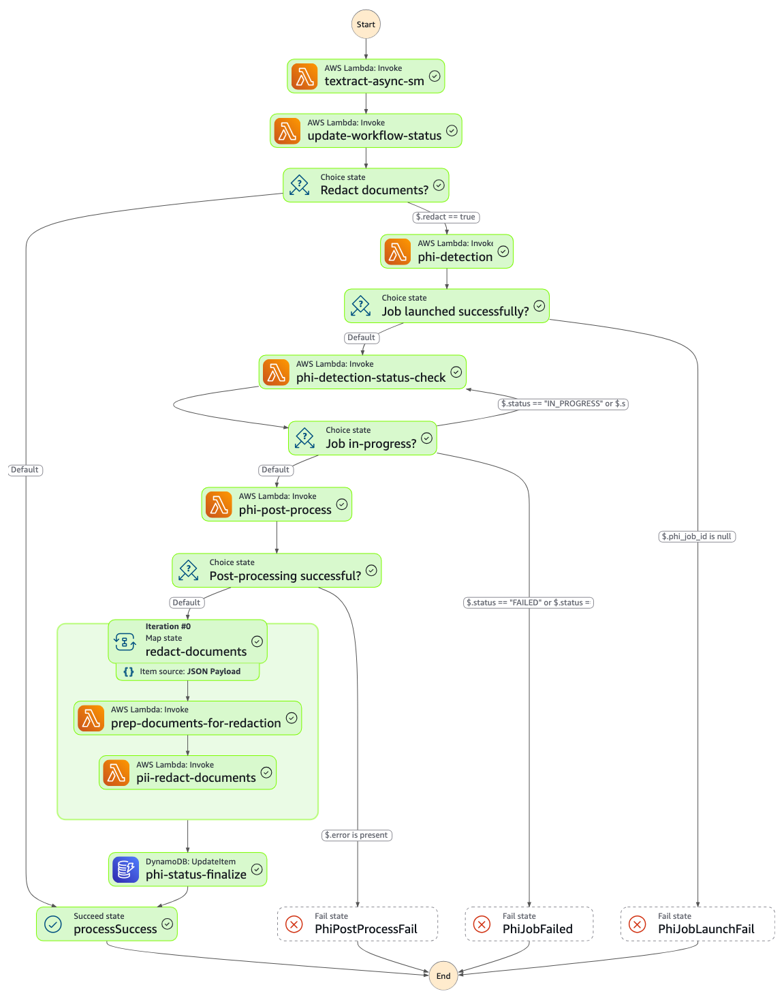

# AWS Services Documentation

This section provides detailed information about each AWS service used in the PII Redaction Pipeline, including their configurations and properties.

## Amazon DynamoDB

DynamoDB is used to store workflow information and track document processing status.

### Table Schema

**Workflow Information:**
- `part_key`: Workflow ID (Primary Key)
- `sort_key`: Input path
- `status`: Workflow status (processed, completed, failed)
- `submit_ts`: Submission timestamp
- `total_files`: Total number of files in the workflow
- `redact`: Boolean flag indicating whether redaction is enabled
- `retain_orig_docs`: Boolean flag indicating whether to retain original documents
- `redaction_status`: Status of the redaction process
- `workflow_token`: Step Functions callback token

**Document Information:**
- Document name
- Processing status (processed, completed, failed)
- Job ID for Textract and Comprehend Medical jobs

**S3 References:**
- File paths and locations in S3 for input, output, and redacted documents



## Amazon S3

S3 is used to store documents at various stages of the PII redaction workflow.

### Bucket Configuration

- **CORS Configuration**: Enabled to allow web application access
- **Encryption**: S3-managed encryption (SSE-S3)
- **Versioning**: Enabled for data protection

### Directory Structure

- `public/workflows/`: Workflow configuration files
- `public/output/`: Textract output files
- `public/phi-output/`: Comprehend Medical PHI detection output
- `public/orig-doc/`: Original documents
- `public/redacted-doc/`: Redacted documents

### Lifecycle Rules (HIPAA-Compliant)

- **PHI Detection Results**:
  - Transition to Glacier storage class after 90 days
  - No automatic deletion (HIPAA compliance requirement)

- **Processed Documents**:
  - Transition to Glacier storage class after 90 days
  - No automatic deletion (HIPAA compliance requirement)

- **Workflows**:
  - Transition to Glacier storage class after 90 days
  - No automatic deletion (HIPAA compliance requirement)

## Amazon Comprehend Medical

Comprehend Medical is used to detect Protected Health Information (PHI) in documents.

### Configuration

- **API**: Using asynchronous `StartPHIDetectionJob` API
- **Language**: English only
- **Job Management**: One job ID per workflow
- **IAM Role**: Custom role for S3 access

### PHI Entities Detected

- Names
- Addresses
- Telephone numbers
- Email addresses
- Dates
- ID numbers
- Professions
- Ages
- Other PHI entities as defined by HIPAA

## Amazon Textract

Textract is used to extract text, forms, and tables from documents.

### Configuration

- **API**: Using asynchronous `StartDocumentAnalysis` API
- **Features**: TABLES and FORMS
- **Notification**: SNS topic for job completion notifications
- **Output**: JSON files stored in S3

## AWS Step Functions

Step Functions orchestrates the document processing workflow in a resilient and scalable manner. The workflow provides automatic retry handling, error management, and parallel processing capabilities.

### State Machine Workflow Diagram

Below is a visual representation of the Step Functions workflow that orchestrates the entire PII/PHI detection and redaction process:



### Workflow Execution Steps

1. **Textract Async Step**: 
   - Triggers asynchronous document processing with Amazon Textract
   - Uses a callback pattern with task tokens for asynchronous completion notification
   - Waits for SNS notifications when Textract jobs complete
   - Handles multiple documents in parallel through the Amazon Textract service

2. **Textract Async Status Update**: 
   - Updates the workflow status in DynamoDB after text extraction
   - Prepares extracted text for PHI detection
   - Determines if redaction is requested based on workflow configuration

3. **Redact Decision Point**: 
   - Evaluates whether PHI detection and redaction should be performed
   - If redaction is not requested, the workflow proceeds directly to completion
   - If redaction is requested, the workflow continues to PHI detection

4. **PHI Detection** (conditional): 
   - Starts asynchronous PHI detection using Amazon Comprehend Medical
   - Segments text into optimal chunks under 70KB limit
   - Returns a job ID for status tracking

5. **PHI Status Check**: 
   - Polls the Comprehend Medical PHI detection job status
   - Implements a loop that continues until the job completes, fails, or times out
   - Manages timeouts to prevent infinite waiting

6. **PHI Post Process**: 
   - Processes PHI detection results from Comprehend Medical
   - Organizes detected entities for redaction
   - Prepares a list of documents to be redacted

7. **Redact Documents Map State**: 
   - Processes multiple documents in parallel using Step Functions Map state
   - For each batch of documents (up to 10 per parallel execution):
     - **Prepare Documents**: Gathers necessary files for redaction
     - **Redact Documents**: Applies redactions to identified PHI entities

8. **PHI Status Update**: 
   - Updates the workflow status to "processed" in DynamoDB
   - Finalizes the workflow execution

### Decision Points and Branching Logic

The workflow includes several decision points:
- **Redaction Decision**: Branches based on whether redaction is requested
- **Job Launch Success**: Verifies PHI detection job was started successfully
- **Job Status**: Routes based on job completion status (completed, failed, or in progress)
- **Post-processing Success**: Verifies PHI results were processed correctly

### Parallel Processing and Performance Optimization

- **Map State for Document Processing**: Processes up to 40 parallel executions with 10 documents each
- **Asynchronous Job Management**: Uses task tokens and callbacks to efficiently manage asynchronous jobs
- **Status Polling**: Implements efficient polling for job status with exponential backoff

### Error Handling and Recovery

- **PHI Job Failed**: Handles failures in Comprehend Medical PHI detection jobs
- **PHI Job Launch Fail**: Manages scenarios where PHI jobs cannot be started
- **PHI Post Process Fail**: Handles errors during post-processing of PHI detection results
- **Automatic Retries**: Implements retry policies for transient failures
- **Error State Tracking**: Updates workflow status in DynamoDB for visibility into failures

This Step Functions workflow provides a robust orchestration layer that coordinates multiple Lambda functions, manages asynchronous processing jobs, and ensures reliable document processing even at scale.

## AWS Lambda

Lambda functions process documents at each step of the workflow.

### Functions

- **poc-init-state-machine**: Triggers the Step Function workflow when files are uploaded
- **poc-init-textract-process**: Processes documents using Textract
- **poc-get-workflow**: Gets workflow records from DynamoDB for the UI
- **poc-update-workflow**: Updates workflow status in DynamoDB
- **poc-process-textract-op**: Processes Textract output
- **poc-init-textract-process-bulk**: Handles Textract job completion notifications
- **poc-phi-detection**: Detects PHI using Amazon Comprehend Medical
- **poc-phi-status-check**: Checks PHI detection job status
- **poc-phi-process-output**: Processes PHI detection output
- **poc-prep-redact**: Prepares documents for redaction
- **poc-redact-documents**: Redacts documents using PHI entities and Textract geometry

### Configuration

- **Runtime**: Python with Docker containers
- **Memory**: 128-256 MB depending on function
- **Timeout**: 1-15 minutes depending on function
- **Environment Variables**: Configured for each function with necessary parameters

## Amazon Cognito

Cognito provides user authentication and authorization.

### User Pool

- **Sign-in Options**: Email
- **Auto-verify**: Email
- **Password Policy**: Minimum 8 characters, require lowercase, uppercase, numbers, and symbols
- **Account Recovery**: Email only

### User Groups

- **Admin**: Full access to PII/PHI data
- **Customer**: Limited access to PII/PHI data

### Identity Pool

- **Authentication Providers**: Cognito User Pool
- **Unauthenticated Access**: Disabled
- **IAM Roles**: Separate roles for authenticated and unauthenticated users

## Amazon SNS

SNS is used for asynchronous job completion notifications.

### Topics

- **Textract Notifications**: Receives notifications when Textract jobs complete
- **Subscribers**: Lambda functions that process job completion events

## Amazon SQS

SQS is used for job submission and processing.

### Queues

- **Document Processing Queue**: Stores messages for document processing jobs
- **Configuration**: 
  - Visibility Timeout: 30 seconds
  - Retention Period: 1,209,600 seconds (14 days)
  - Encryption: KMS managed

## AWS Amplify

Amplify is used to host the React web application.

### Configuration

- **Branch**: main
- **Framework**: React
- **Build Settings**: Default
- **Custom Rules**: Single-page application redirect

--------------------------
# Lambda Functions

### 1. `machine-state.py`

**Purpose:** Entry point for the workflow, triggered when a workflow configuration file is uploaded to S3.

**Key Functionality:**
- Reads workflow configuration from S3
- Stores workflow metadata in DynamoDB
- Queues documents for processing in SQS
- Starts the Step Functions state machine

**Input:** S3 event when a workflow configuration file is uploaded
**Output:** Initializes workflow in DynamoDB and starts Step Functions state machine

### 2. `extract.py`

**Purpose:** Processes documents using Amazon Textract to extract text, forms, and tables.

**Key Functionality:**
- Retrieves document processing messages from SQS
- Starts asynchronous Textract document analysis jobs
- Stores the Step Functions callback token in DynamoDB
- Updates workflow status

**Input:** Event data from Step Functions containing workflow_id, token, and bucket
**Output:** List of Textract job IDs

### 3. `textract-bulk.py`

**Purpose:** Processes Textract job completion notifications and manages batch document processing.

**Key Functionality:**
- Handles SNS notifications when Textract jobs complete
- Invokes post-processing Lambda function asynchronously
- Tracks document processing progress
- Checks if additional documents need processing
- Signals Step Functions when all documents are processed

**Input:** SNS notification from Textract when a job completes
**Output:** Success response to Step Functions or submits additional documents for processing

### 4. `textract-output.py` (not examined but inferred from code)

**Purpose:** Processes the output from Textract document analysis jobs.

**Key Functionality:**
- Processes Textract job results to extract structured information
- Creates JSON outputs for use in downstream processing
- Prepares text for PHI detection

**Input:** Textract job ID and output location
**Output:** Processed text data for PHI detection

### 5. `pii-detection.py`

**Purpose:** Initiates PHI detection using Amazon Comprehend Medical.

**Key Functionality:**
- Starts asynchronous PHI detection jobs
- Configures input and output locations for Comprehend Medical
- Handles error conditions
- Updates workflow status in DynamoDB if errors occur

**Input:** Event data from Step Functions containing workflow_id, phi_input_dir, and bucket
**Output:** Dictionary with workflow_id, bucket, phi_job_id, and phi_output_dir

### 6. `status-check.py`

**Purpose:** Monitors the status of asynchronous PHI detection jobs.

**Key Functionality:**
- Polls Comprehend Medical for job status
- Implements timeout logic
- Updates workflow status in case of failure
- Returns job status to Step Functions

**Input:** Event data containing workflow_id, phi_job_id, and phi_output_dir
**Output:** Job status and related metadata

### 7. `pii-output.py`

**Purpose:** Processes the output from PHI detection jobs and prepares for redaction.

**Key Functionality:**
- Copies PHI detection results to workflow output directory
- Moves original documents to appropriate location
- Organizes documents for parallel processing
- Sets up data for the Map state in Step Functions

**Input:** Event data containing workflow_id, phi_output_dir, and bucket
**Output:** Document list organized into batches for parallel redaction

### 8. `prep-doc-for-redaction.py`

**Purpose:** Prepares documents for redaction by gathering necessary files.

**Key Functionality:**
- Locates Comprehend Medical PHI output files
- Locates Textract JSON output files
- Locates original documents
- Creates a mapping between these files for redaction

**Input:** Event data containing workflow_id, doc_prefixes, and bucket
**Output:** Dictionary with workflow_id, bucket, retain_docs, and redact_data

### 9. `redact.py`

**Purpose:** Applies redactions to documents based on detected PHI entities.

**Key Functionality:**
- Loads Textract JSON and Comprehend Medical JSON
- Downloads original documents
- Converts documents to images
- Identifies text bounding boxes containing PHI entities
- Draws black rectangles over sensitive information
- Saves and uploads redacted documents
- Handles cleanup of temporary files

**Input:** Event data containing workflow_id, redact_data, bucket, and retain_docs
**Output:** Redaction status

### 10. `get-workflows.py`

**Purpose:** Retrieves workflow information for the frontend application.

**Key Functionality:**
- Provides an API to query workflow status
- Retrieves all workflows within a date range
- Retrieves detailed information for a specific workflow
- Formats workflow data for frontend consumption
- Includes links to redacted documents when available

**Input:** API Gateway event with query parameters
**Output:** Workflow data in JSON format

### 11. `update-wf-status.py`

**Purpose:** Updates workflow status in DynamoDB after text extraction.

**Key Functionality:**
- Retrieves document processing status from temporary files
- Updates workflow status in DynamoDB
- Cleans up temporary files
- Forwards redaction flag to next step

**Input:** Event data containing workflow_id, tmp_process_dir, and phi_input_dir
**Output:** Updated workflow status and redaction flag

## S3 Helper Class

All Lambda functions leverage a shared `S3Functions.py` module which provides:

- Listing objects and prefixes
- Getting object content
- Copying and moving objects
- Deleting objects
- Uploading and downloading files

This helper class simplifies S3 operations and provides consistent error handling across the Lambda functions.

## Workflow Integration

These Lambda functions work together as part of a Step Functions workflow to:

1. Process uploaded documents using Textract (`extract.py`, `textract-bulk.py`, `textract-output.py`)
2. Detect PHI/PII using Comprehend Medical (`pii-detection.py`, `status-check.py`, `pii-output.py`)
3. Redact sensitive information (`prep-doc-for-redaction.py`, `redact.py`)
4. Track workflow status and provide results (`update-wf-status.py`, `get-workflows.py`)

The workflow is triggered by document upload events and managed through DynamoDB for state tracking, SQS for message queuing, and Step Functions for orchestration.


# initialize CDK : 
1. install NodeJs (wbesite)
2. install AWS CLi (website)
3. connect aws account + machine
4. install CDK globally
```bash
npm install -g aws-cdk
```
5. install javascript 
```bash 
npm -g install javascript
```
6. initialize app : 
```bash
cdk init app --language javascript
```
# CDK commands
### Bootstarp:
```bash 
cdk bootstarp
```
### synthesize: 
Synthesizes CloudFormation templates from your CDK code
```bash 
cdk synthesize
```
### Build: 
```bash 
cdk run build
```
### Deploy: 
```bash 
cdk deploy
```
### Other: 
1. CDK help 
```bash 
cdk help
```
2. List stacks : 
```bash 
cdk list
```

# Welcome to your CDK JavaScript project

This is a blank project for CDK development with JavaScript.

The `cdk.json` file tells the CDK Toolkit how to execute your app. The build step is not required when using JavaScript.

## Useful commands

* `npm run test`         perform the jest unit tests
* `npx cdk deploy`       deploy this stack to your default AWS account/region
* `npx cdk diff`         compare deployed stack with current state
* `npx cdk synth`        emits the synthesized CloudFormation template

## gitlab : 
## initialize Git repository
```bash 
git init
```
## Add the GitLab repository as a SSH remote named 'origin'
```bash
git remote add origin git@ssh.gitlab.aws.dev:miniarja/Pii-Redaction-Pipeline.git
```
## Check if the remote was added successfully
```bash
git remote -v
```
## Configure your Git user information (if not already configured)
```bash
git config user.name "miniarja"
git config user.email "miniarja@amazon.fr"
```
## Check the status of your repository
```bash
git status
```
## Stage any unstaged files
```bash
git add .
```
## Commit any changes
```bash
git commit -m "Prepare for linking to GitLab repository"
```
## If the remote repository already has content you want to merge
```bash
git pull origin main --allow-unrelated-histories
```
## Push your local content to the GitLab repository
```bash
git push -u origin main
```
