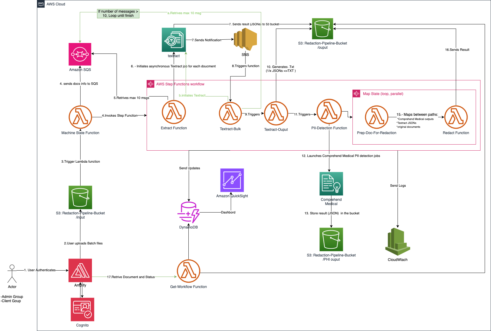

# Secure Shield: PII Redaction Pipeline - Deployment Guide

This guide provides step-by-step instructions for deploying the Secure Shield PII Redaction Pipeline. The solution uses AWS CDK to provision all required infrastructure and services.

## Table of Contents

- [Secure Shield: PII Redaction Pipeline - Deployment Guide](#secure-shield-pii-redaction-pipeline---deployment-guide)
  - [Table of Contents](#table-of-contents)
  - [Prerequisites](#prerequisites)
  - [Environment Setup](#environment-setup)
  - [Backend Deployment](#backend-deployment)
  - [Frontend Deployment](#frontend-deployment)
  - [Verification](#verification)
  - [User Management](#user-management)
    - [Adding Users](#adding-users)
    - [Managing User Groups](#managing-user-groups)
  - [Troubleshooting](#troubleshooting)
  - [Additional Resources](#additional-resources)
  - [Security Considerations](#security-considerations)
  - [Architecture](#architecture)

## Prerequisites

Before starting deployment, ensure you have:

- **AWS Account** with administrator access
- **AWS CLI** installed and configured with appropriate credentials
- **Node.js** (v14 or later) and npm installed
- **AWS CDK Toolkit** installed: `npm install -g aws-cdk`
- **Python 3.8+** installed (for Lambda function dependencies)
- **Git** to clone the repository

## Environment Setup

1. **Clone the Repository**

   ```bash
   git clone https://gitlab.aws.dev/miniarja/Pii-Redaction-Pipeline.git
   cd Pii-Redaction-Pipeline-main
   ```

2. **Create Environment Variables**

   Create a `.env` file in the `backend` directory:

   ```bash
   cd backend
   touch .env
   ```

   Add the following environment variables:

   ```
   # AWS Configuration
   AWS_ACCOUNT_ID=your-aws-account-id
   PII_REGION=us-east-1  # or your preferred region

   # S3 Bucket Configuration
   ROOT_BUCKET=secure-shield-docs-YYYYMMDD  # Use a globally unique name

   # Cognito Configuration
   DOMAIN_COGNITO=secure-shield
   ADMIN_USER=admin@example.com
   ADMIN_PASSWORD=StrongPassword123!  # Use a secure password
   CUSTOMER_USER=customer@example.com
   CUSTOMER_PASSWORD=StrongPassword456!  # Use a secure password
   CUSTOMER_ROLE=customer
   ```

   > **Important**: Use strong passwords and a globally unique S3 bucket name.

3. **Install Backend Dependencies**

   ```bash
   npm install
   ```

4. **Install Frontend Dependencies**

   ```bash
   cd ../frontend
   npm install
   cd ..
   ```

## Backend Deployment

1. **Bootstrap CDK** (if not already done in your AWS account)

   ```bash
   cd backend
   cdk bootstrap aws://ACCOUNT-NUMBER/REGION
   ```

   Replace `ACCOUNT-NUMBER` with your AWS account ID and `REGION` with your target region.

2. **Synthesize CloudFormation Templates** (Optional)

   ```bash
   npm run cdk-synth
   ```

   This step is optional but useful to validate the CloudFormation templates before deployment.

3. **Deploy All Stacks**

   ```bash
   npm run cdk-deploy
   ```

   This command deploys:
   - CdkPIIAppStack (Cognito, S3)
   - PIIBackendStack (DynamoDB, SQS, SNS)
   - PIILambdaStack (Lambda functions)
   - PIIStepFunctionStack (Step Functions workflow)
   - PIIWebDeployStack (Amplify hosting)

4. **Note Output Values**

   After deployment completes, note the following outputs:
   - Cognito User Pool ID
   - Cognito Web Client ID
   - S3 bucket name
   - Amplify app URL

## Frontend Deployment

The frontend deployment happens automatically as part of the CDK deployment process using AWS Amplify. However, if you need to make changes and redeploy:

1. **Update Frontend Configuration** (if needed)

   The `gen-auth-config.js` script is run as part of the deployment to generate the necessary AWS configuration for the frontend.

2. **Rebuild Frontend** (if you make changes)

   ```bash
   cd frontend
   npm run build
   ```

3. **Redeploy Frontend Only** (if needed)

   ```bash
   cd ../backend
   npm run cdk-deploy-web
   ```

## Verification

1. **Access the Application**

   Open the Amplify app URL provided in the CDK outputs.

2. **Log In**

   Use the admin credentials you specified in the `.env` file:
   - Username: Your configured `ADMIN_USER`
   - Password: Your configured `ADMIN_PASSWORD`

3. **Upload Test Document**

   - Navigate to "Process Documents"
   - Upload a test document (PDF, JPEG, PNG, or TIFF)
   - Observe the workflow status in "Review Documents"

4. **Check AWS Resources**

   Verify that:
   - S3 buckets have been created with the expected structure
   - Lambda functions have been deployed
   - Step Functions workflows are created
   - DynamoDB tables exist

## User Management

### Adding Users

1. **Access AWS Console** and navigate to Amazon Cognito
2. Select your Cognito User Pool (name contains `secure-shield`)
3. Go to "Users and groups"
4. Click "Create user"
5. Enter user information and assign to either "admin" or "customer" group

### Managing User Groups

- **Admin Group**: Full access to all documents and PII/PHI data
- **Customer Group**: Limited access with PII/PHI information redacted

## Troubleshooting

For detailed troubleshooting information, please refer to the [Troubleshooting Guide](troubleshooting.md).

## Additional Resources

- [AWS CDK Documentation](https://docs.aws.amazon.com/cdk/)
- [AWS Amplify Documentation](https://docs.amplify.aws/)
- [AWS Step Functions Documentation](https://docs.aws.amazon.com/step-functions/)
- [Amazon Textract Documentation](https://docs.aws.amazon.com/textract/)
- [Amazon Comprehend Medical Documentation](https://docs.aws.amazon.com/comprehend-medical/)

## Security Considerations

- Regularly rotate Cognito user passwords
- Monitor CloudTrail for suspicious API calls
- Review IAM permissions for least privilege
- Enable S3 bucket logging for audit purposes
- Configure CloudWatch alarms for security events

## Architecture

For detailed information about the system architecture, please refer to the [Architecture Documentation](architecture.md).


